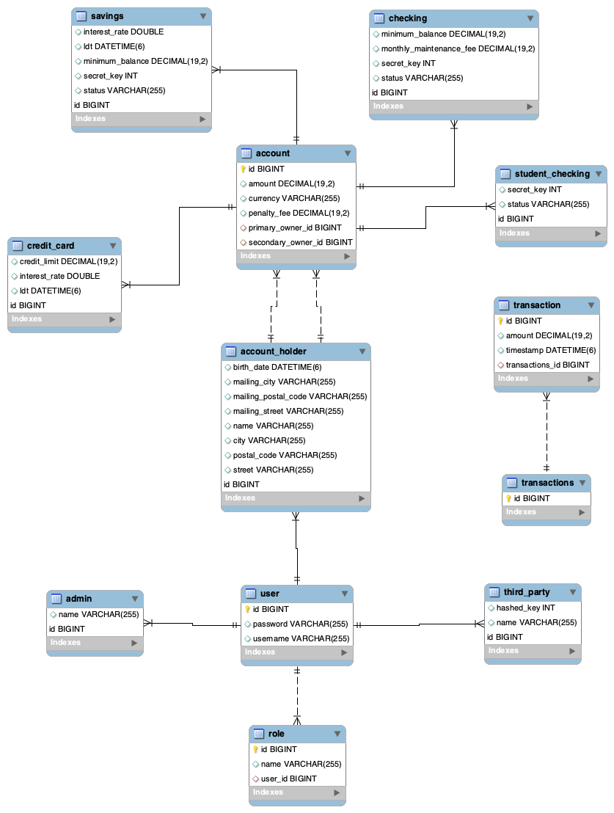

# Midterm Project

##BANKING SYSTEM MODEL: 

This banking system has 4 types of accounts: Checking, Student Checking, Savings and Credit Card accounts. Student Checkings are practically the same as Checkings, but are automatically created when an account holder is younger than 24 years old. 

There are 3 types of users: Account Holders, Admins and Third Parties. Account Holders can have as many accounts of any type as they want (with the restriction of the age in the St. Checking case), and can access these accounts as they please. They can also send and get money to and from any account just by typing the id of the target account. Admins can get any information from users or accounts, they can also debit and credit any account, and are the only ones with the authorisation
to add new users or accounts to the DB. Third Parties can only debit and credit accounts.

There is also a repository of Transactions which is conformed by account ids and every Transaction done by that account. If two or more transactions are done within a second, the status of said account is immediately changed to FROZEN, in order to prevent fraud from happening. 
